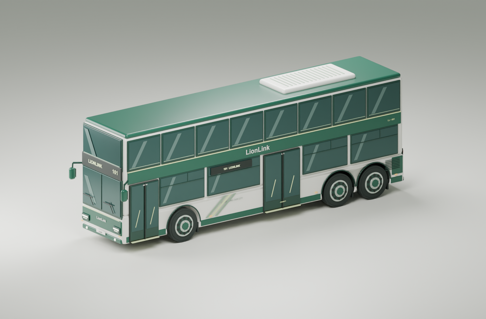

# LionLink 3D bus assets

Original Singapore-inspired double-decker bus in LionLink cream, forest green,
sage, and soft lime. The model was built from scratch using the
[MAN ND 323F listing](https://www.cgtrader.com/3d-models/vehicle/bus/singapore-bus-man-nd-323f)
as a silhouette reference and the supplied LionLink visual theme. No marketplace
mesh or textures are included.



## Choose an asset

| File                                             | Purpose                                                                                                |
| ------------------------------------------------ | ------------------------------------------------------------------------------------------------------ |
| `lionlink-bus.glb`                               | Static display model, merged by material: approximately 4.3 MiB, 15 draw calls.                        |
| `lionlink-maintenance.glb`                       | Interactive model with component IDs and editable sign surfaces: approximately 3.8 MiB, 80 draw calls. |
| `lionlink-bus.blend`                             | Editable static model, packed fonts, studio lights and camera.                                         |
| `lionlink-maintenance.blend`                     | Editable interactive source with component metadata and sign UVs.                                      |
| `components.json`                                | Semantic repair targets, associated mesh IDs, marker anchors, and location limitations.                |
| `asset-info.json`, `interactive-asset-info.json` | Export metrics and identifiers.                                                                        |

Both GLBs are self-contained, use standard glTF PBR materials, and need no
external textures or compression decoder. Studio cameras, lights, and ground
are excluded. The interactive asset's seven sign surfaces are blank until the
application supplies textures. The static asset includes fixed `101` lettering.

The GLB coordinate system is metres, Y-up, front facing **-X**, with the curb-side
doors facing **+Z**. The body is approximately 12 m long and 2.5 m wide; mirrors
extend beyond the body, and the roof unit brings height to approximately 4.51 m.
Blender sources use Z-up; the exporter converts axes.

## Load in the web app

Place the chosen GLB at a public asset URL (for example, copy it to
`apps/web/public/models/lionlink-maintenance.glb`) and load it with Three.js
`GLTFLoader`. These files are deliberately kept under `assets/` until a feature
needs them, so this PR does not change application routes, UI, or dependencies.

```js
import { GLTFLoader } from "three/addons/loaders/GLTFLoader.js"

const { scene: bus } = await new GLTFLoader().loadAsync(
  "/models/lionlink-maintenance.glb"
)
scene.add(bus)
```

Use scene lighting or an environment map for the PBR materials. See the
[GLTFLoader documentation](https://threejs.org/docs/#examples/en/loaders/GLTFLoader).

### Repair selection and markers

Component roots and exported meshes have `extras.part_id`, available as
`object.userData.part_id` after loading. A glTF mesh containing multiple material
primitives can become a group with child meshes; walk up the parent chain if a
picked mesh does not itself have a `part_id`.

Use `components.json` to map a repair's explicit component ID to mesh IDs and an
anchor. `THREE.Raycaster` can pick the visible mesh, and a projected anchor can
position a clickable HTML marker. Clone materials before changing their emissive
color so highlighting one part does not alter other parts sharing that material.

Direct exterior targets include doors, six wheels, lights, mirrors, wipers,
windscreen, passenger windows, bodywork, and roof air conditioning. The `doors`
semantic target highlights both doors if the source does not specify which one.

Cooling, electrical, pneumatic, suspension, and brake targets are **illustrative
system areas**. Their internals are not modeled, and the anchor is not evidence
of an exact fault location. Preserve `approximate` and `note` from the catalog in
the feature's UI. A free-text repair needs an explicit component selection or a
user-confirmed suggestion; ambiguous descriptions should not silently acquire an
exact location.

This is a DD exterior model, with opaque stylized glazing and no passenger
interior or animation rig. Choose a separate SD model for single-decker vehicles.

### Dynamic service number and fleet identifier

The interactive GLB includes these stable sign IDs:

- `display_service_front`, `display_service_side`, `display_service_rear`
- `display_fleet_front`, `display_fleet_rear`
- `display_fleet_left`, `display_fleet_right`

Render the desired string onto a canvas and assign a `THREE.CanvasTexture` to the
sign mesh material. Set `texture.colorSpace = THREE.SRGBColorSpace` and
`texture.flipY = false` to match the glTF UV convention. After redrawing the
canvas, set `texture.needsUpdate = true`. A `MeshBasicMaterial` with
`toneMapped: false` keeps destination text readable.

Keep service numbers as strings, including suffixes such as `410G` and leading
zeroes. Fit the font to the panel width. Fleet ID and service number are separate
fields; a workshop vehicle without an assigned service should not be given a
fabricated route. Use the selected trip's assignment when available rather than
assuming the vehicle's usual service is its current service.

## Rebuild and validate

Tested with Blender 5.1.2 and Three.js 0.180.0. Run from this directory:

```sh
blender --background --python build_bus.py
blender --background --python export_interactive.py
node validate-assets.mjs
```

The scripts overwrite generated outputs. The static build also renders the
preview. For equivalent lettering on a different platform, set
`LIONLINK_FONT_BOLD` and `LIONLINK_FONT_REGULAR` to your font files. The builder
uses macOS Arial paths when available and Blender's built-in font otherwise;
fallback lettering can have different metrics. Saved `.blend` files already
contain packed fonts and do not require these paths to open.

`validate-assets.mjs` checks GLB structure, embedded buffers, component targets,
seven UV-mapped sign surfaces, export metrics, and exclusion of studio objects.
Both delivered GLBs were also checked with Khronos glTF Validator with zero
errors or warnings. The standalone prototype was browser-tested for dynamic
route text, repair highlighting, mesh picking, and narrow-screen rendering; that
prototype UI is not part of this asset-only PR.
