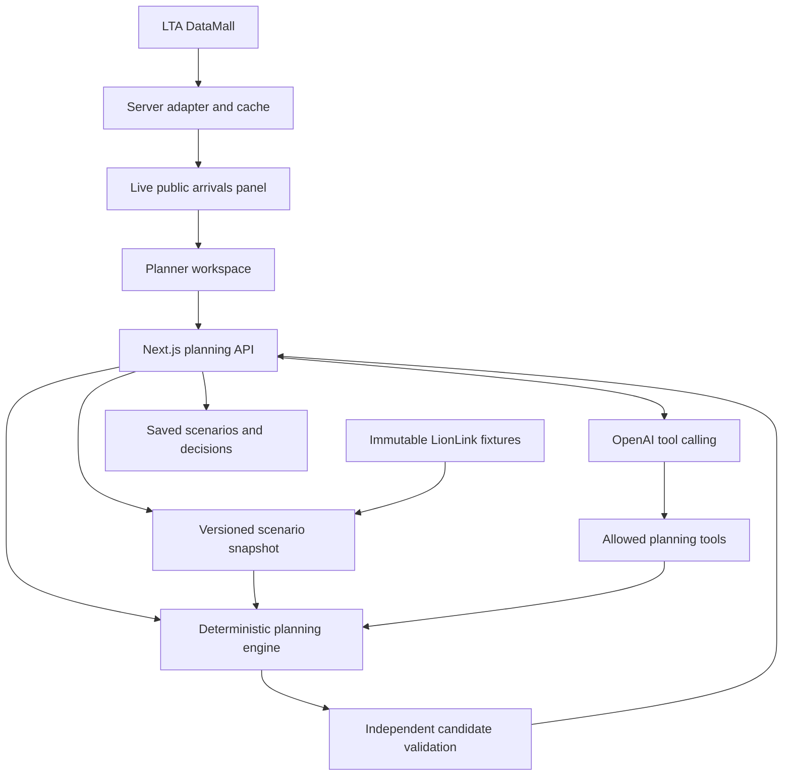

# LionLink scheduling copilot MVP plan

Build a working bootcamp MVP in the existing Next.js application. A planner selects a dated operating scenario, inspects vehicle and driver constraints, compares feasible alternatives, asks an OpenAI assistant to explain them, and saves a reviewed proposal. LTA DataMall supplies public network references and a live arrivals panel. The application keeps live public observations separate from fictional LionLink operating records.

Scope agreed on 7 October 2026: a working bootcamp MVP, with access to OpenAI and LTA DataMall APIs. Start with services 235 and 238. Expand to services 132 and 159 and workshop scheduling after the initial workflow works. Approval in the MVP records a simulation decision; it does not send instructions to an operator.

## Existing project context

The implementation repository is `/Users/shafiqninaba/Desktop/Repositories/openai-fde-bootcamp`. It contains the dashboard, stakeholder decks, documentation, shared components and verified snapshots. The current chat workspace contains separate analysis and bus assets. The original operator console and raw data are in Downloads. These folders must be consolidated through explicit imports rather than runtime dependencies on personal filesystem paths.

| Area | Current capability | How the MVP uses it |
| --- | --- | --- |
| `apps/web` | Next.js 16.3.6, React 19.3.0, TypeScript, Tailwind v4; read-only fleet and operations dashboard | Add a planner route and preserve the evidence reports |
| `packages/ui` | Shared shadcn/ui components on Base UI, theme and charts | Compose all new controls from this package |
| `apps/web/data/operations` | 21 compressed tables, manifest, aggregate report | Immutable fixture adapter and indexed scenario imports |
| `apps/web/lib` | Fleet/report calculations, passenger matches, boarding history | Reuse metrics and source references; extract planning contracts separately |
| `apps/web/app/api/operations/route.ts` | GET summaries, paginated records and downloads | Keep existing reporting API; add separate planning APIs |
| `apps/slides` | Scheduling, maintenance, ridership and AI scheduling decks | Preserve evidence; update demonstrated product behavior after implementation |
| `apps/docs` | Starlight evidence definitions and findings | Add operator instructions after the workflow stabilizes |
| Chat workspace `output/lionlink-analysis` | Analysis, retrospective replays, workshop proposals and assumed economics | Import selected cases as reproducible tests with explicit assumptions |
| Chat workspace `lionlink-bus` | Three.js maintenance model, semantic components and repair markers | Optional later vehicle detail view |
| Downloads `lionlink-operations-source` | Original static console, CSVs, dictionary, schema and SQLite rebuild script | Reference definitions and reconcile imports |

The application has no planner, solver, write API, authentication, scenario database or live ingestion pipeline. Its existing cached reports assume immutable fixtures. New operational state therefore needs its own storage and versioning.

Implementation must follow repository `AGENTS.md`: shared UI imports, no additional primitive component library, installed Next.js documentation before coding, and `pnpm check` plus build verification. The latest AI scheduling deck provides the intended product story; the earlier decks chiefly establish problems and evidence limits.

## Evidence and initial decisions

The fictional operating extract contains 6,900 trips and 252,380 stop calls over ten weekday mornings, 5–16 October 2026. There are 172 timetable vehicles and eight separate held workshop vehicles. Scheduled departures cover 06:00–11:59; downstream calls remain in the extract. Historical maintenance covers eight selected buses, not the operating fleet.

| Evidence | Product implication |
| --- | --- |
| 48 departures and 100 arrivals exceed five minutes of delay; 52 late arrivals started within five minutes of schedule | Check running time and downstream consequences alongside departure recovery |
| Services 132 and 159 account for 90 of the 100 late arrivals | Expansion priority once the smaller workflow works |
| Service 235 replay retains 44 trips over two dates and changes seven late departures to zero under its assumptions | Useful assignment demonstration and regression case; rerun without advance knowledge |
| Service 238 retiming models 721 fewer origin waiting person-minutes over ten dates and retains 2,968 boardings | Useful comparison case; two days worsen and minimum turnaround slack is 54 seconds |
| October 19 workshop proposal preserves eight protected trips but has a gap only 20 seconds above the minimum | Show conditional releases and sensitivity to running time before calling it robust |

These figures come from the checked-in [AI evidence](../apps/slides/content/ai-scheduling-evidence.json) and the chat workspace analysis. The replays preserve eventual observed running durations and make causal assumptions. They are retrospective comparisons, not measured AI performance or forecasts. Queue observations can count the same people repeatedly; boardings are events, not unique customers.

The local DataMall comparison reports that all 36 selected route directions and 1,353 ordered stop records matched the retrieved network snapshot on 7 October. That validates the network reference used in the exercise; it does not connect real arriving buses to fictional fleet identifiers.

## MVP experience

Add `/planner` beside `/dashboard`. The main workspace should expose the selected scenario date, decision time and evidence mode continuously.

1. Select the service 235 recovery scenario or service 238 timetable experiment. Use 7 October at 05:50 as a post-decision recovery review: control action `NW-A0017`, issued at 05:50, supplies the baseline instruction, and the listed relief driver checks in at 05:45. A separate prospective test of the original decision must use a cutoff before that action.
2. Inspect the baseline timeline, vehicle readiness, driver commitments and evidence. Distinguish recorded facts, estimates and assumptions.
3. Request alternatives through controls or a question such as “Can the listed relief driver cover this duty without changing published trips?”
4. Review two or three candidates alongside the baseline. Show assignment changes, conflicts, minimum slack, protected trips and modeled outcomes where supported.
5. Inspect the assistant's explanation and open the referenced source records.
6. Save a proposal, approve it for the exercise or reject it with a reason. Reload and recover the same plan version and evidence.

Provide separate modes for **scenario planning**, **retrospective replay** and **live public arrivals**. A planner looking at an October 14 fixture cannot use today's arrivals as that fixture's historical observations. Live context uses the real retrieval time; optionally copying it into a simulated scenario creates an explicitly labeled assumption.

Every candidate must show whether it is feasible under known constraints, conditional on missing confirmation, infeasible, or unevaluated. Retaining the baseline with an explanation is a valid outcome.

## Recommended architecture

Keep the existing Next.js application as the user interface and application server. Add domain modules for typed scenarios, as-of views, validation, candidate generation and scoring. Provider access stays in server-only modules. Next.js recommends a server-only data access layer with authorization checks and minimal DTOs; use that boundary for credentials and saved plans. [Next.js data security](https://nextjs.org/docs/app/guides/data-security).

For the bootcamp, start with bounded candidate enumeration in TypeScript: listed compatible vehicle/crew substitutions and permitted timetable offsets. Revalidate and score every candidate. This avoids adding a second deployed runtime before the first workflow is usable.

When the candidate combinations or workshop resources exceed this bounded approach, add a Python OR-Tools worker behind the same request/response contract. CP-SAT supports integer time and interval/no-overlap scheduling. Preserve `OPTIMAL`, `FEASIBLE`, `INFEASIBLE`, `MODEL_INVALID` and `UNKNOWN`; a timeout without a solution does not prove infeasibility. The application validator still checks returned plans. [OR-Tools scheduling](https://developers.google.com/optimization/scheduling/job_shop), [solver status](https://developers.google.com/optimization/cp/cp_solver).

Use a separate SQLite database for local scenario persistence on a single persistent server. Keep source fixtures immutable. SQLite is suitable for this application scale but has one writer at a time; horizontal deployment or heavy concurrent writes require revisiting the store. [SQLite deployment guidance](https://www.sqlite.org/whentouse.html). Database driver selection is an implementation task, not an existing repository dependency.

Proposed code locations, all currently new:

| Location | Responsibility |
| --- | --- |
| `apps/web/lib/planning/` | Contracts, temporal views, constraints, candidates, scoring and replay |
| `apps/web/lib/server/` | Fixture loading, database access, provider adapters and assistant orchestration |
| `apps/web/components/planner/` | Workspace, timeline, comparisons, evidence and review controls |
| `apps/web/app/planner/` | Planner route |
| `apps/web/app/api/planning/` | Scenarios, evaluation, assistant and review mutations |
| `apps/web/app/api/datamall/arrivals/` | Validated public arrivals proxy |
| `apps/web/scripts/` | Reproducible imports and evaluation runner |
| `apps/web/__tests__/planning/` | Domain, API and scenario tests |

## Data and temporal contracts

A scenario stores its ID and version, fixture snapshot/hash, service and route scope, Singapore decision time, planning horizon, baseline assignments, proposed changes and explicit assumptions. Store validation reports, scores, evidence references and review decisions against that exact version.

Normalize identifiers as strings, including stop codes with leading zeroes and services such as `410G`. Preserve route direction and stop order; a repeated physical stop is not necessarily the same passenger cohort. Use integer seconds for resource timing and retain offset-aware source timestamps.

Record envelopes distinguish `source`, `source_record_id`, `issued_at`, `observed_at`, `effective_from`, `effective_until` and `retrieved_at` where available. Do not invent missing issue times. Published timetable fields can be admitted as scenario inputs with documented publication assumptions; eventual actual departures, arrivals and durations remain hidden until their observation cutoff. Tables without availability metadata cannot become authoritative live updates.

Define timestamp ties explicitly: an inclusive cutoff admits records issued at that time. In the 05:50 review, `NW-A0017` is an existing baseline instruction, not a prediction target. To evaluate the original 05:50 decision, use 05:49:59 and withhold that action until scoring.

Import all records for resources affected by a change, including duties outside the selected service. Checking only the currently filtered trips can miss a conflict. Reconcile counts, IDs, timestamps and hashes against the manifest. Move useful external replay code into reproducible adapters; remove absolute Downloads paths.

Persist `scenarios`, `plan_versions`, `validation_runs`, `decisions` and append-only `audit_events`. Save and approve through transactions with version checks and idempotency keys. A changed source snapshot or plan invalidates the prior validation and approval. Approval cannot manufacture an Engineering release.

## Deterministic constraints and scoring

Translate the supplied `NW-PC01` through `NW-PC07` into named rules with source references. They are fictional exercise rules.

- Preserve listed trips and complete routes. In future timetable mode, offsets are at most ten minutes, origin gaps at most thirty minutes, and the first route-direction departure remains fixed. Recovery mode preserves published instructions unless explicitly modeled otherwise.
- Use only listed resources, capacities, qualifications and availability windows. A resource is usable only within a confirmed release window. Estimated workshop completion creates a conditional branch, not a release.
- Include positioning, final alighting, turnaround, boarding and driver takeover without double-counting intervals allowed to overlap. Apply the source's 45-second alighting, 420-second turnaround, movement-related boarding and 300-second takeover semantics.
- Prevent overlapping vehicle tasks and driver tasks, including movement and takeover. Preserve breaks and the maximum 300-minute task span specified in the fixture.
- Enforce passenger and accessibility capacities where supplied. Missing accessibility capacity produces an unknown or conditional result.
- Gate facts by the decision cutoff. Never allocate tomorrow's or later-issued resources to an earlier decision.
- Replay arrivals FIFO with the supplied dwell rules and keep route-position cohorts separate. Do not infer destinations or rail transfer outcomes.

Treat unknown inputs separately from conflicts. Rank feasible candidates by protected service coverage, then supported passenger waiting measures, delay, operational slack and number of changes. Publish the ranking policy; unsupported passenger estimates cannot silently contribute zeros. Add a running-time sensitivity check and flag plans whose feasibility depends on narrow margins.

For advance planning, start with published runtimes and explicit uncertainty allowances. Add simple route/time historical estimates only when sufficient earlier data exists. Use later outcomes solely for evaluation. Ten exercise mornings do not justify a production demand forecasting model.

## OpenAI integration

Use the Responses API with a small set of strict function tools. The application executes tools and validates their arguments. Schema adherence does not establish operational correctness, so every proposal passes domain checks. [OpenAI function calling](https://developers.openai.com/api/docs/guides/function-calling), [structured outputs](https://developers.openai.com/api/docs/guides/structured-outputs).

Initial tools: `get_scenario`, `get_resource_evidence`, `find_candidates`, `evaluate_plan` and `compare_candidates`. Return bounded structured records and stable evidence IDs. Keep saving and approval in explicit UI/API actions rather than model tools.

The assistant interprets intent, selects tools and explains computed results. It must identify conditional releases, missing facts and worse outcomes. Numeric comparisons come from tool outputs. Evidence links resolve through an allowlist. External notes are treated as data, not tool instructions.

Set budgets for tool iterations, time and tokens; report provider failures and retain manual comparison controls. Log model identifier, prompt/schema version, tool calls, latency and usage. Select the model available to this API account using a small quality/latency/cost evaluation rather than assuming a Codex model label is an API identifier. Fine-tuning, vector search and multiple autonomous agents are unnecessary for the initial workflow.

## LTA DataMall integration

Use a server adapter with `AccountKey`; retain service/stop identifiers as text. Import `BusServices`, `BusRoutes` and `BusStops` with pagination, checksums and route-version comparisons.

Use `/ltaodataservice/v3/BusArrival` for selected stops and optional services. The documented update cadence is twenty seconds; share a cache and pause inactive polling. Display the next three estimates, monitored status, load category, accessibility and retrieval time. Empty estimates and unavailable responses need explicit states. [LTA API guide version 6.10](https://datamall.lta.gov.sg/content/dam/datamall/datasets/LTA_DataMall_API_User_Guide.pdf).

Load categories are not exact passenger counts. The live panel provides public context, not crew commitments, Engineering release or fictional fleet identity. Preserve direction/visit ambiguity. Start with Toa Payoh and selected 235/238 stops; add alerts or traffic feeds only after the core workflow.

Keys belong in server environment variables. Add `.env.example` names only, validate configuration and never include keys in browser bundles, prompts, source control or logs. Bound requests, handle rate limits and show stale cached data honestly.

## Delivery sequence and acceptance criteria

The following is a proposed sequence, not a committed deadline. Allow roughly ten to fifteen focused development days for one engineer familiar with the repository; confirm the bootcamp deadline before committing dates. Slices 1–5 deliver the essential demonstration; slice 6 verifies it before handoff.

| Slice | Deliverable | Acceptance criteria | Depends on |
| --- | --- | --- | --- |
| 1 | Contracts, fixture import and planner workspace | 235 scenario loads from repository data; decision cutoff excludes later records; source counts reconcile | Existing snapshots |
| 2 | Constraint validator and baseline timeline | Deliberately invalid assignments expose named conflicts; held vehicle, missing crew and break cases block feasibility | 1 |
| 3 | Candidate comparison | Real listed 235 relief option competes with baseline; future timetable mode evaluates 238 offsets; all candidates revalidated | 2 |
| 4 | OpenAI assistant | Calls allowed tools, explains comparisons with valid evidence IDs; no invented release or resource; manual workflow survives API failure | 3 |
| 5 | DataMall context and persistent review | Live arrivals load with freshness; scenario approval survives reload; source/version changes invalidate prior approval | 1–4 |
| 6 | Evaluation and demo hardening | Regression cases, adversarial prompts, concurrent version conflict and provider failure pass; reports distinguish replay from prospective results | 1–5 |
| 7 | Workshop and visual extension | Workshop conflict and conditional replan work; optional DD maintenance view preserves source work-order status | 6 |

Prioritize a usable vertical slice at each stage. Do not build all ingestion, prediction, optimization and visualization features before a planner can compare one scenario.

## Verification and demonstration

Keep existing accounting, source checksum, passenger matching and operations-query tests. Add meaningful planning cases: resource double booking; held vehicle past an estimate; future-issued update; wrong qualification; break/takeover/movement conflicts; missing capacity; incomplete protected trips; stale approval; unavailable provider; and an outcome where retaining the baseline wins.

Maintain two evaluation sets. Retrospective regression reproduces supplied replay arithmetic and its limits. Prospective evaluation reconstructs decision-time knowledge and freezes plans before exposing outcomes. Compare the assistant workflow with manual controls and simple rules using the same available data. Test both non-beneficial 238 days. Use a chronological holdout or rolling cutoff, documenting the small sample.

An initial assistant evaluation set of around thirty scenarios should cover ordinary questions, unsupported requests and misleading notes. Check tool selection, argument validity, evidence resolution and numerical consistency; inspect complete tool traces when failures occur. [OpenAI evaluation guidance](https://developers.openai.com/api/docs/guides/agent-evals).

MVP gates: zero known hard-constraint violations in accepted plans, all protected trips retained, all reported evidence IDs resolvable, no future observations in prospective inputs, and correct stale/unavailable states. Suggested performance goals are cached views under two seconds and bounded candidate generation under five seconds on the demo machine; measure before promising them.

Run `pnpm check` and `pnpm build` for implementation changes. Add browser verification of scenario selection, comparison, assistant interaction, approval/reload and an API outage. Use recorded provider responses in repeatable tests, with a small manual live API smoke test.

Demo sequence: open the 235 scenario; expose the cover conflict; ask for a feasible alternative; compare the listed relief driver assignment; inspect evidence and approve the exercise plan; reload it; show live public arrivals with its own clock; demonstrate rejection of an unreleased vehicle. Present 238 as a what-if that can worsen some days rather than a guaranteed improvement.

## Maintenance visualization and later scope

The existing viewer supports repair markers, semantic part IDs and dynamic identity labels. Integrate it only after the planning workflow, through a client component that loads and disposes the viewer. Keep the ordinary repair table usable without WebGL. The model represents a double-decker; select suitable geometry or an explicit schematic state for single-deckers. Internal system anchors are illustrative, and component selection does not confirm diagnosis.

Later scope includes workshop bay/technician optimization, incident and festival scenarios, richer runtime estimates, operator integrations and authenticated staff roles. A real pilot needs authoritative full-day vehicle/crew commitments, Engineering events, observed feed history and operational review. DataMall access alone cannot supply these private records.

## Value and pilot criteria

The deck proposes two weeks of shadow use followed by four supervised weeks. Its targets are 50% less planner time, 20% less waiting on selected duties, complete protected-trip retention and zero hard-constraint violations. Keep them as hypotheses. The supplied 238 replay's modeled total reduction is approximately 2.2%, so it does not establish the 20% target.

The assumed economics use two planners saving two hours daily over 250 days at S$45/hour: S$45,000 annual capacity value, S$50,000 setup and S$12,000 yearly operation. First-year net capacity value is negative S$17,000. Released time becomes cash savings only when an actual expense is avoided. Recalculate from observed planning/review/rework time and measured API/hosting costs; the pilot's 50% target differs from the business case's roughly 67% reduction.

The next implementation task is slice 1 plus the smallest part of slice 2: load the 235 fixture at 05:50, show its resources and commitments, validate a proposed assignment and explain a conflict with source evidence. API credentials need to be configured when implementing provider access; no additional key discovery is needed for this planning work.
